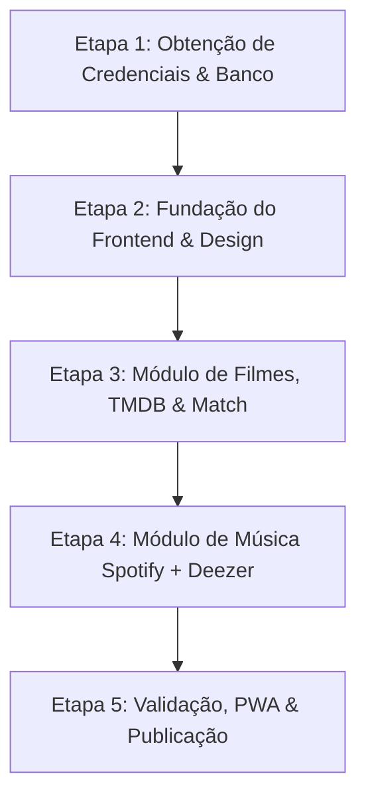

# 00 - Plano de Execução Mestre (Guia Passo a Passo)

## 1. Visão Geral da Execução
Este documento é o **mapa de operação prático**. Ele define a ordem exata de execução dos planos criados (`01` a `06`), dividindo as tarefas entre o que **você (Eduardo)** precisa fazer e o que **eu (o assistente)** farei de forma automatizada.

---

## 2. Matriz de Responsabilidades (Quem faz o quê?)

```
+────────────────────────────────────────┬────────────────────────────────────────+
|           VOCÊ (Eduardo)               |             ASSISTENTE (Eu)            |
+────────────────────────────────────────┼────────────────────────────────────────+
| 1. Criar projeto no Supabase (1 min)   | 1. Executar comandos de setup no shell |
| 2. Rodar o script SQL no Supabase      | 2. Criar toda a árvore de código fonte |
| 3. Gerar chave gratuita no TMDB (2 min)| 3. Configurar Tailwind, temas e fontes |
| 4. Me passar as chaves ou colar no .env| 4. Programar as integrações de API     |
| 5. Testar no celular e dar feedback    | 5. Programar o Sorteador e os Modais   |
| 6. Conectar na Vercel para deploy final| 6. Corrigir eventuais bugs e validar   |
+────────────────────────────────────────┴────────────────────────────────────────+
```

---

## 3. As 5 Etapas de Execução (Do Zero à Produção)



---

### ETAPA 1: Obtenção de Credenciais & Banco de Dados (Duração: ~5 minutos)
Esta é a única etapa que depende de você no navegador:

1. **Criar Projeto no Supabase**:
   - Acesse [supabase.com](https://supabase.com) e crie um novo projeto (ex: `nossa-sessao`).
   - Vá em **Project Settings > API** e copie:
     - `Project URL`
     - `anon public key`
2. **Rodar o Banco de Dados**:
   - No painel do Supabase, clique em **SQL Editor** no menu lateral esquerdo.
   - Abra o arquivo [02-banco-de-dados-supabase.md](file:///c:/Users/Inteli/Documents/app%20filmes/planos/02-banco-de-dados-supabase.md).
   - Copie o bloco de código SQL (Seção 3) e cole no SQL Editor do Supabase.
   - Clique em **Run** (Ctrl + Enter).
   - *Resultado esperado:* Mensagem de sucesso e 5 tabelas criadas.
3. **Gerar Chave no TMDB (The Movie Database)**:
   - Acesse [themoviedb.org](https://www.themoviedb.org) e crie uma conta.
   - Vá em **Configurações > API > Criar > Desenvolvedor**.
   - Preencha os campos básicos (nome do app: "Nossa Sessão") e pegue sua **API Key (v3 auth)**.
4. **Disponibilizar no `.env`**:
   - Assim que tiver essas chaves, basta me passar ou colocar no arquivo `.env`.

---

### ETAPA 2: Fundação do Frontend & Design System (Automatizado pelo Assistente)
Assim que autorizada a execução:

1. **Setup Inicial**:
   - Rodar `npm create vite@latest . -- --template react-ts`
   - Instalar dependências: `@supabase/supabase-js`, `@tanstack/react-query`, `zustand`, `lucide-react`, `framer-motion`, `canvas-confetti`, `clsx`, `tailwind-merge`, `vite-plugin-pwa`.
2. **Estilização**:
   - Configurar o `tailwind.config.ts` com a paleta exata do [05-interface-e-design-system.md](file:///c:/Users/Inteli/Documents/app%20filmes/planos/05-interface-e-design-system.md).
   - Configurar fontes modernas e efeitos de *glassmorphism*.
3. **Estrutura de Estado**:
   - Criar a store do Zustand para gerenciar o perfil ativo (`'eduardo' | 'laura'`).
   - Implementar o **Header** e o **ProfileSwitcher** com animações de toque.
4. **Ponto de Controle / Checkpoint 1**:
   - Rodar servidor local (`npm run dev`) e verificar se a interface abre limpa, no tema escuro, alternando entre Eduardo e Laura.

---

### ETAPA 3: Módulo de Filmes, TMDB & Match do Casal (Automatizado pelo Assistente)

1. **Serviço TMDB & Busca**:
   - Criar `src/lib/tmdb.ts` com busca em português brasileiro.
   - Criar o componente de busca com *debounce* e cartazes em miniatura.
2. **Sistema de Listas (Árvore de Filmes)**:
   - Implementar as 4 abas:
     - `🔥 Match do Casal`
     - `👤 Sugeridos por Edu`
     - `🌸 Sugeridos por Lau`
     - `✅ Já Assistidos`
3. **Mecânica do Match**:
   - Se Laura clicar em curtir o filme que Edu sugeriu (ou vice-versa), o app dispara o efeito de confetes e move o card para o Match.
4. **Sorteador "O que ver hoje? 🎲"**:
   - Desenvolver o modal com roleta acelerada que desacelera até revelar o filme em comum sorteado.
5. **Modal de Avaliação Pós-Filme**:
   - Criar os sliders de nota (0 a 10), cálculo da média do casal, seletor de "Quem Dormiu?" e tags divertidas (*"Choramos"*, *"Plot Twist"*).
6. **Ponto de Controle / Checkpoint 2**:
   - Fazer um teste real: adicionar 2 filmes, simular aprovação de ambos, testar o sorteador e registrar uma avaliação no Supabase.

---

### ETAPA 4: Módulo de Música (Spotify + Deezer Bridge) (Automatizado pelo Assistente)

1. **Integração Songlink**:
   - Criar `src/lib/songlink.ts` consumindo a API da Odesli.
   - Input onde qualquer um cola link do Spotify ou Deezer e o app descobre o par correspondente.
2. **Cards com Links Nativos**:
   - Botão verde que abre no app do Spotify do Eduardo.
   - Botão roxo que abre no app do Deezer da Laura.
3. **Aba de Playlists Fixas**:
   - Componente com iframes oficiais embutidos para ouvir playlists inteiras direto na página.
4. **Ponto de Controle / Checkpoint 3**:
   - Colar 1 link de música e verificar se gerou ambos os botões com sucesso.

---

### ETAPA 5: PWA, Otimização e Deploy Final

1. **Configuração de PWA**:
   - Gerar ícones e configurar `manifest.webmanifest` para permitir instalação na tela inicial do celular como aplicativo nativo.
2. **Build de Produção**:
   - Rodar `npm run build` para checar se o TypeScript e Vite compilam com zero erros.
3. **Deploy na Vercel (100% Gratuito)**:
   - Subir no GitHub.
   - Importar na Vercel e cadastrar as variáveis do `.env`.
   - Gerar link público com certificado HTTPS.
4. **Instalação nos Celulares**:
   - Enviar o link para a Laura e instalar no seu celular.

---

## 4. Como Dar a Partida?

Você só precisa decidir quando quer começar:
- Se você quiser iniciar **agora**, eu posso criar a estrutura do projeto React + Tailwind + componentes imediatamente enquanto você pega as chaves do Supabase e TMDB.
- Ou se você quiser pegar as chaves primeiro, basta me avisar quando estiver com elas!
