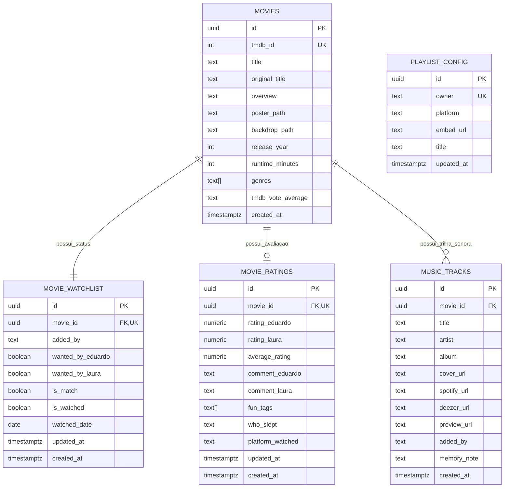

# 02 - Banco de Dados (Supabase & PostgreSQL)

## 1. Arquitetura de Dados e Princípios
O banco de dados utiliza **PostgreSQL 15** hospedado na infraestrutura do Supabase. A arquitetura foi desenhada para priorizar:
1. **Integridade Referencial**: Relacionamento estrito entre filmes, watchlist e notas com remoção em cascata (`ON DELETE CASCADE`).
2. **Desempenho em Tempo Real**: Índices compostos cobrindo filtros comuns (ex: filmes com match pendente e não assistidos).
3. **Sincronização Instantânea**: WebSockets via `supabase_realtime` transmitindo alterações imediatamente para o smartphone do parceiro.
4. **Procedimentos Armazenados (RPC)**: Lógicas críticas (como o sorteio aleatório ponderado) executadas diretamente no banco para máxima velocidade.

---

## 2. Diagrama Entidade-Relacionamento Completo



---

## 3. Script SQL Completo de Produção (DDL)

Copie e execute o bloco abaixo diretamente no **SQL Editor** do seu painel Supabase:

```sql
-- ====================================================================
-- 1. EXTENSÕES & CONFIGURAÇÕES INICIAIS
-- ====================================================================
CREATE EXTENSION IF NOT EXISTS "uuid-ossp";

-- ====================================================================
-- 2. TABELA PRINCIPAL: MOVIES (Cache do Catálogo do TMDB)
-- ====================================================================
CREATE TABLE IF NOT EXISTS public.movies (
    id UUID PRIMARY KEY DEFAULT uuid_generate_v4(),
    tmdb_id INTEGER UNIQUE NOT NULL,
    title TEXT NOT NULL,
    original_title TEXT,
    overview TEXT,
    poster_path TEXT,
    backdrop_path TEXT,
    release_year INTEGER,
    runtime_minutes INTEGER,
    genres TEXT[] DEFAULT '{}',
    tmdb_vote_average NUMERIC(3,1),
    created_at TIMESTAMPTZ NOT NULL DEFAULT TIMEZONE('utc', NOW())
);

-- Índices de busca rápida
CREATE INDEX IF NOT EXISTS idx_movies_tmdb_id ON public.movies (tmdb_id);
CREATE INDEX IF NOT EXISTS idx_movies_title ON public.movies USING gin (to_tsvector('portuguese', title));

-- ====================================================================
-- 3. TABELA: MOVIE_WATCHLIST (Status, Desejos e Match do Casal)
-- ====================================================================
CREATE TABLE IF NOT EXISTS public.movie_watchlist (
    id UUID PRIMARY KEY DEFAULT uuid_generate_v4(),
    movie_id UUID UNIQUE NOT NULL REFERENCES public.movies(id) ON DELETE CASCADE,
    added_by TEXT NOT NULL CHECK (added_by IN ('eduardo', 'laura', 'ambos')),
    wanted_by_eduardo BOOLEAN NOT NULL DEFAULT FALSE,
    wanted_by_laura BOOLEAN NOT NULL DEFAULT FALSE,
    is_match BOOLEAN GENERATED ALWAYS AS (wanted_by_eduardo AND wanted_by_laura) STORED,
    is_watched BOOLEAN NOT NULL DEFAULT FALSE,
    watched_date DATE,
    created_at TIMESTAMPTZ NOT NULL DEFAULT TIMEZONE('utc', NOW()),
    updated_at TIMESTAMPTZ NOT NULL DEFAULT TIMEZONE('utc', NOW())
);

-- Índices para performance das abas da UI
CREATE INDEX IF NOT EXISTS idx_watchlist_match ON public.movie_watchlist (is_match, is_watched);
CREATE INDEX IF NOT EXISTS idx_watchlist_eduardo ON public.movie_watchlist (wanted_by_eduardo, is_watched);
CREATE INDEX IF NOT EXISTS idx_watchlist_laura ON public.movie_watchlist (wanted_by_laura, is_watched);
CREATE INDEX IF NOT EXISTS idx_watchlist_watched ON public.movie_watchlist (is_watched, watched_date DESC);

-- ====================================================================
-- 4. TABELA: MOVIE_RATINGS (Notas, Avaliações, Tags e "Quem Dormiu")
-- ====================================================================
CREATE TABLE IF NOT EXISTS public.movie_ratings (
    id UUID PRIMARY KEY DEFAULT uuid_generate_v4(),
    movie_id UUID UNIQUE NOT NULL REFERENCES public.movies(id) ON DELETE CASCADE,
    rating_eduardo NUMERIC(3,1) CHECK (rating_eduardo >= 0.0 AND rating_eduardo <= 10.0),
    rating_laura NUMERIC(3,1) CHECK (rating_laura >= 0.0 AND rating_laura <= 10.0),
    average_rating NUMERIC(3,1) GENERATED ALWAYS AS (
        CASE 
            WHEN rating_eduardo IS NOT NULL AND rating_laura IS NOT NULL THEN ROUND((rating_eduardo + rating_laura) / 2.0, 1)
            WHEN rating_eduardo IS NOT NULL THEN rating_eduardo
            WHEN rating_laura IS NOT NULL THEN rating_laura
            ELSE NULL 
        END
    ) STORED,
    comment_eduardo TEXT,
    comment_laura TEXT,
    fun_tags TEXT[] DEFAULT '{}',
    who_slept TEXT DEFAULT 'ninguem' CHECK (who_slept IN ('ninguem', 'eduardo', 'laura', 'ambos')),
    platform_watched TEXT,
    created_at TIMESTAMPTZ NOT NULL DEFAULT TIMEZONE('utc', NOW()),
    updated_at TIMESTAMPTZ NOT NULL DEFAULT TIMEZONE('utc', NOW())
);

CREATE INDEX IF NOT EXISTS idx_ratings_average ON public.movie_ratings (average_rating DESC);

-- ====================================================================
-- 5. TABELA: MUSIC_TRACKS (Trilha Sonora Spotify & Deezer)
-- ====================================================================
CREATE TABLE IF NOT EXISTS public.music_tracks (
    id UUID PRIMARY KEY DEFAULT uuid_generate_v4(),
    movie_id UUID REFERENCES public.movies(id) ON DELETE SET NULL,
    title TEXT NOT NULL,
    artist TEXT NOT NULL,
    album TEXT,
    cover_url TEXT,
    spotify_url TEXT,
    deezer_url TEXT,
    preview_url TEXT,
    added_by TEXT NOT NULL CHECK (added_by IN ('eduardo', 'laura')),
    memory_note TEXT,
    created_at TIMESTAMPTZ NOT NULL DEFAULT TIMEZONE('utc', NOW())
);

CREATE INDEX IF NOT EXISTS idx_music_created_at ON public.music_tracks (created_at DESC);

-- ====================================================================
-- 6. TABELA: PLAYLIST_CONFIG (Playlists Fixas Embutidas)
-- ====================================================================
CREATE TABLE IF NOT EXISTS public.playlist_config (
    id UUID PRIMARY KEY DEFAULT uuid_generate_v4(),
    owner TEXT UNIQUE NOT NULL CHECK (owner IN ('eduardo', 'laura', 'casal')),
    platform TEXT NOT NULL CHECK (platform IN ('spotify', 'deezer')),
    embed_url TEXT NOT NULL,
    title TEXT NOT NULL,
    updated_at TIMESTAMPTZ NOT NULL DEFAULT TIMEZONE('utc', NOW())
);

-- ====================================================================
-- 7. TRIGGERS AUTOMÁTICOS DE ATUALIZAÇÃO DE DATA (updated_at)
-- ====================================================================
CREATE OR REPLACE FUNCTION update_timestamp_column()
RETURNS TRIGGER AS $$
BEGIN
    NEW.updated_at = TIMEZONE('utc', NOW());
    RETURN NEW;
END;
$$ LANGUAGE plpgsql;

DROP TRIGGER IF EXISTS trg_watchlist_updated_at ON public.movie_watchlist;
CREATE TRIGGER trg_watchlist_updated_at
    BEFORE UPDATE ON public.movie_watchlist
    FOR EACH ROW EXECUTE FUNCTION update_timestamp_column();

DROP TRIGGER IF EXISTS trg_ratings_updated_at ON public.movie_ratings;
CREATE TRIGGER trg_ratings_updated_at
    BEFORE UPDATE ON public.movie_ratings
    FOR EACH ROW EXECUTE FUNCTION update_timestamp_column();

-- ====================================================================
-- 8. STORED PROCEDURE / RPC: Sorteador de Filme do Match
-- ====================================================================
CREATE OR REPLACE FUNCTION get_random_match_movie()
RETURNS TABLE (
    movie_id UUID,
    tmdb_id INTEGER,
    title TEXT,
    poster_path TEXT,
    backdrop_path TEXT,
    overview TEXT,
    release_year INTEGER,
    runtime_minutes INTEGER,
    genres TEXT[]
) AS $$
BEGIN
    RETURN QUERY
    SELECT 
        m.id,
        m.tmdb_id,
        m.title,
        m.poster_path,
        m.backdrop_path,
        m.overview,
        m.release_year,
        m.runtime_minutes,
        m.genres
    FROM public.movies m
    JOIN public.movie_watchlist w ON m.id = w.movie_id
    WHERE w.is_match = TRUE 
      AND w.is_watched = FALSE
    ORDER BY RANDOM()
    LIMIT 1;
END;
$$ LANGUAGE plpgsql;

-- ====================================================================
-- 9. CONFIGURAÇÃO DE SEGURANÇA (Row Level Security - RLS)
-- ====================================================================
ALTER TABLE public.movies ENABLE ROW LEVEL SECURITY;
ALTER TABLE public.movie_watchlist ENABLE ROW LEVEL SECURITY;
ALTER TABLE public.movie_ratings ENABLE ROW LEVEL SECURITY;
ALTER TABLE public.music_tracks ENABLE ROW LEVEL SECURITY;
ALTER TABLE public.playlist_config ENABLE ROW LEVEL SECURITY;

CREATE POLICY "Acesso Total Movies" ON public.movies FOR ALL USING (true) WITH CHECK (true);
CREATE POLICY "Acesso Total Watchlist" ON public.movie_watchlist FOR ALL USING (true) WITH CHECK (true);
CREATE POLICY "Acesso Total Ratings" ON public.movie_ratings FOR ALL USING (true) WITH CHECK (true);
CREATE POLICY "Acesso Total Music" ON public.music_tracks FOR ALL USING (true) WITH CHECK (true);
CREATE POLICY "Acesso Total PlaylistConfig" ON public.playlist_config FOR ALL USING (true) WITH CHECK (true);

-- ====================================================================
-- 10. HABILITAÇÃO DO SUPABASE REALTIME (WebSockets)
-- ====================================================================
ALTER PUBLICATION supabase_realtime ADD TABLE public.movie_watchlist;
ALTER PUBLICATION supabase_realtime ADD TABLE public.movie_ratings;
ALTER PUBLICATION supabase_realtime ADD TABLE public.music_tracks;
```
