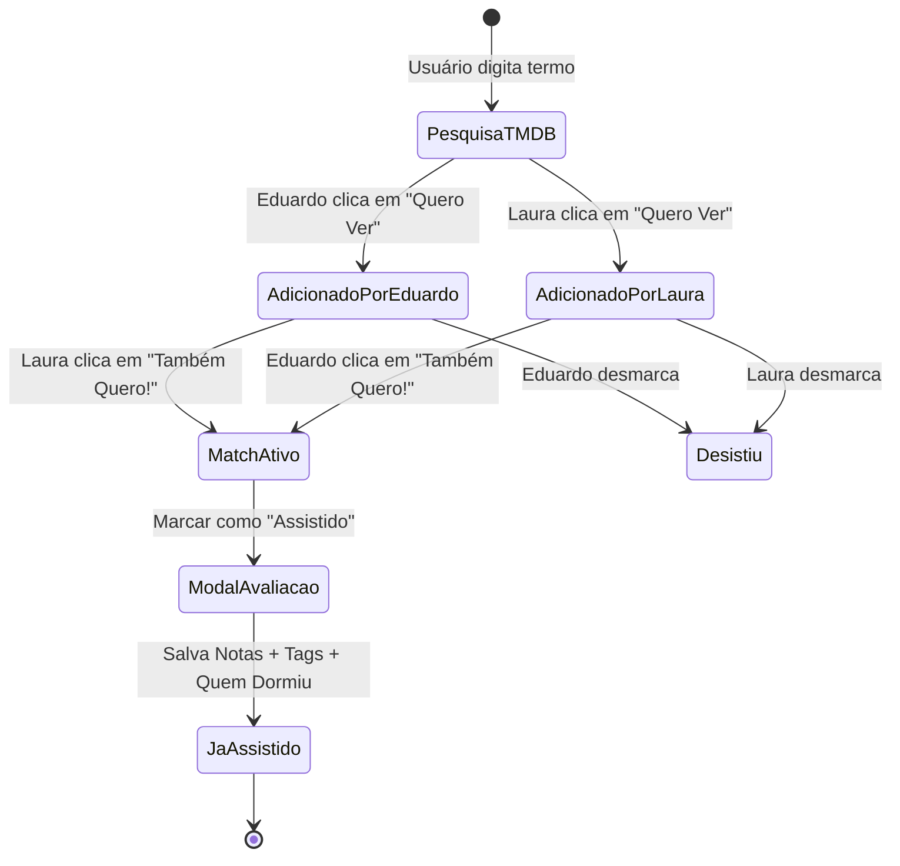

# 03 - Módulo de Filmes e Match do Casal (Engenharia e Telas)

## 1. Arquitetura da "Árvore de Listas"

O sistema de exibição de filmes é segmentado em **4 visualizações chave**, selecionáveis via abas no topo da página de filmes:

```
[ ABA DE NAVEGAÇÃO ]
┌──────────────────────────┬──────────────────────────┬──────────────────────────┬──────────────────────────┐
│ 🔥 MATCH DO CASAL (12)    │ 👤 SUGERIDOS POR EDU (8) │ 🌸 SUGERIDOS POR LAU (5) │ ✅ JÁ ASSISTIDOS (24)    │
└──────────────────────────┴──────────────────────────┴──────────────────────────┴──────────────────────────┘
```

### Regras de Negócio e Transições de Estado:



1. **Adicionado por Eduardo**:
   - `wanted_by_eduardo = true`, `wanted_by_laura = false`, `is_watched = false`.
   - Aparece na aba **"Sugeridos por Edu"**.
   - No perfil da Laura, o card exibe um botão chamativo: **"Quero ver também! 💖"**.
2. **Adicionado por Laura**:
   - `wanted_by_laura = true`, `wanted_by_eduardo = false`, `is_watched = false`.
   - Aparece na aba **"Sugeridos por Lau"**.
   - No perfil do Eduardo, o card exibe o botão: **"Quero ver também! 💖"**.
3. **Match do Casal (Gatilho Automático)**:
   - Quando ambos marcam `true`, a coluna computada `is_match` torna-se `true`.
   - O filme migra instantaneamente para a aba principal **🔥 Match do Casal**.
   - Dispara animação de confetes / brilho na interface (Framer Motion).
4. **Marcar como Assistido**:
   - Disponível em qualquer card de Match ou individual.
   - Abre o **Modal de Avaliação do Casal**.
   - Transfere o filme para a aba **✅ Já Assistidos** (`is_watched = true`).

---

## 2. Integração com a API do TMDB (The Movie Database)

### 2.1 Fluxo de Busca com Debounce (300ms)
Para evitar requisições desnecessárias a cada tecla digitada:
- Hook customizado: `useMovieSearch(query: string)`
- Utiliza `useDebounce(query, 300)`
- Endpoint oficial:
  ```http
  GET https://api.themoviedb.org/3/search/movie?api_key={TMDB_KEY}&query={query}&language=pt-BR&page=1&include_adult=false
  ```

### 2.2 Estrutura da Resposta e Mapeamento para o Banco Supabase:
```typescript
interface TMDBMovieResult {
  id: number;
  title: string;
  original_title: string;
  overview: string;
  poster_path: string | null;
  backdrop_path: string | null;
  release_date: string; // "2024-03-01"
  vote_average: number;
  genre_ids: number[];
}

// Ao salvar no Supabase, mapeamos:
const movieToInsert = {
  tmdb_id: tmdb.id,
  title: tmdb.title,
  original_title: tmdb.original_title,
  overview: tmdb.overview,
  poster_path: tmdb.poster_path ? `https://image.tmdb.org/t/p/w500${tmdb.poster_path}` : null,
  backdrop_path: tmdb.backdrop_path ? `https://image.tmdb.org/t/p/original${tmdb.backdrop_path}` : null,
  release_year: tmdb.release_date ? parseInt(tmdb.release_date.substring(0, 4)) : null,
  tmdb_vote_average: tmdb.vote_average,
  genres: mapGenreIdsToNames(tmdb.genre_ids)
};
```

---

## 3. O Sorteador de Filmes ("O que ver hoje? 🎲")

### 3.1 Mecânica e Algoritmo
1. **Filtro Estrito**: Apenas filmes que estejam na aba **Match do Casal** (`is_match = true` e `is_watched = false`).
2. **Método**:
   - Pode chamar a RPC do Supabase `get_random_match_movie()` ou sortear client-side na lista já carregada em cache.
3. **Animação Visual (Slot Machine / Roleta de Cinema)**:
   - Ao clicar em **"🎲 Sortear Filme de Hoje"**, abre-se o modal em tela cheia com efeito *glassmorphism*.
   - Uma sequência rápida de cartazes passa girando (efeito de carrossel acelerado por 2.5 segundos via Framer Motion).
   - O carrossel desacelera suavemente até parar no filme escolhido.
   - Efeito sonoro sutil de "tick-tick-tick... boom!" ao travar o filme vencedor.
4. **Opções após o sorteio**:
   - **🍿 "Vamos Assistir Esse!"**: Destaca o filme e dá opção de ir direto para o streaming.
   - **🔄 "Girar Novamente"**: Dá direito a um segundo sorteio.

---

## 4. O Modal de Avaliação & Veredito Pós-Filme

Ao clicar em **"Marcar como Assistido"**, abre-se o formulário de avaliação completo:

### A) Notas Individuais (0.0 a 10.0 com passo de 0.5):
- Slider ou seletores de estrelas duplos:
  - **Nota do Eduardo**: Ex: 8.5
  - **Nota da Laura**: Ex: 9.0
- **Badge Dinâmico da Média**:
  - Exibe instantaneamente: **Média: 8.8**
  - Cores dinâmicas:
    - 9.0 - 10.0: Dourado Brilhante 🏆
    - 7.0 - 8.9: Roxo/Verde Neon ⭐
    - 5.0 - 6.9: Amarelo Sutil 😐
    - Abaixo de 5.0: Vermelho Escuro ❌

### B) Veredito "Quem Dormiu? 😴":
Quatro botões estilo toggle:
- `[ Ninguém ]`
- `[ Eduardo ]`
- `[ Laura ]`
- `[ Os Dois ]`

### C) Tags Divertidas e Humor (Multi-seleção):
Pílulas clicáveis que mudam de cor ao selecionar:
- `😭 Desidratamos de Chorar`
- `🤯 Explodiu a Mente (Plot Twist)`
- `🍕 Filme de Domingo / Conforto`
- `🍿 Pipocão Divertido`
- `💤 Deu um Soninho Gostoso`
- `🔥 Obra-prima Absoluta`
- `🤡 Esperávamos Mais`
- `😱 Dá Medo Real`

### D) Onde Assistiram (Contexto):
- `[ Cinema ]` | `[ Netflix ]` | `[ Max ]` | `[ Prime Video ]` | `[ Disney+ ]` | `[ Apple TV+ ]`

### E) Espaço de Crítica Rápida:
- Campo de texto para comentário do Eduardo (máx. 280 caracteres).
- Campo de texto para comentário da Laura (máx. 280 caracteres).

---

## 5. Visualização do Histórico ("Já Assistidos")
- Cards com o pôster, a data em que foi visto e o badge com a **Média do Casal** no canto superior direito.
- Ao clicar no card, abre a "Ficha da Sessão":
  - Quem dormiu;
  - As tags selecionadas;
  - Os comentários de cada um lado a lado.
- Ordenação disponível:
  - *Mais Recentes*
  - *Melhores Avaliados pelo Casal*
  - *Filmes com Maior Divergência de Nota* (onde um amou e o outro odiou!).
